# 手書きホワイトボード — デモ版 設計書（Unity WebGL）

- リポジトリ名：`handwriting-whiteboard-unity-demo`
- 対象エディション：デモ版（アイデアの視覚化）
- プラットフォーム：ゲーム（Unity WebGL／C#／PlayerPrefs／Unity Play）
- 対象入力：PCのマウス＋キーボードのみ。タッチ・ペン・筆圧は対象外（スマホ版の要件とし、本書では扱わない）
- 対象Unityバージョン：Unity 6.3 LTS／Input System パッケージ（参照日：2026年9月5日）

---

## 1. 概要

### 1.1 課題

ブラウザを開いてすぐマウスで手書きでき、書いたものがブラウザに残り、消去・Undo・パン・ズームが素直に効く、手書き専用の軽量ホワイトボードが求められている。既存の汎用ホワイトボードは付箋・図形・テンプレートが主体で手書きの書き味が二の次であり、ブラウザ標準のイベント処理に直接依存するとホイールでページがスクロールする・右クリックでメニューが出る・窓外でボタンを離すと線が伸び続ける等の入力事故を端末・ブラウザごとに潰す必要がある。

本サービスは「線を引くこと」に機能を絞る。滑らかなペン、ストローク単位の消去、Undo／Redo、パン／ズーム、自動保存、PNG書き出しのみを持つ。入力処理はUnityのInput Systemに閉じ、ブラウザ既定動作はWebGLテンプレートで一括して抑止する。同一のC#コードベースをのちにスマホアプリへ展開できることを前提に、UIは固定レイアウト（画面幅に応じた再配置を行わない）とする。

### 1.2 デモ版の到達点

来場者が「URLを開く → 何も設定せずにマウスで書く → 太さ・色を切り替える → 消しゴムで線単位に消す → Ctrl+Z／Ctrl+Yで取り消す・やり直す → ホイールでズーム、Space＋ドラッグまたは中ボタンでパンする → リロードしても線が残っている → ボードを複数持てる → PNGで保存できる」という一連の体験を、PCのブラウザだけで完結して行える展示物とする。

### 1.3 ターゲットとプラットフォームの選定理由

- 成果物を直接操作・閲覧するのは板に書く利用者（人間）であるため、人間向けプラットフォームから選定する。
- 入力に応じて出力が変わる対話的な成果物であり、電子書籍・動画は不適である。
- **ゲーム（Unity WebGL）を選択する。** 理由は次の3点。
  1. 入力処理をUnityのInput Systemに閉じ込め、ブラウザごとのイベント差異（ホイール・右クリック・キーボードショートカット・窓外でのボタン解放）をWebGLテンプレートの1箇所で抑止できる。素のブラウザ実装では端末×ブラウザの組み合わせごとのデバッグが必要になる。
  2. 同一のC#コードベースをのちにiOS／Androidアプリへ展開できる。タッチ・ペン・筆圧はその段で入力層のみ差し替えて対応する前提とし、本デモではPCマウスに限定して描画・履歴・保存のコアを確立する。
  3. ストロークをMeshとして描き、カメラのズーム・パンで表示を制御するため、ストローク数が増えても再描画コストが増えない。
- ウェブ（Canvas API）は選択しない。共有リンクなどサーバを要する機能を本デモでは持たず、入力処理の堅牢性はUnity側に寄せる方針のため。
- AI機能は持たない。ルールベースで完結する。

### 1.4 デモ版の適用制約

| 項目 | 適用内容 |
|---|---|
| 実装方式 | 複数issueへの分割実装（Manager.md方針・2026-09-08改訂。当初の1issueワンショット方針で発行した issue #1 は指示内容の確認のため一旦クローズし、Manager.mdの並列開発フレームワークに沿って再設計した） |
| 外部API | 一切使用しない。フォント・アイコン・解析・外部ストレージを取得しない。PNG書き出しはブラウザ内のダウンロード呼び出し（jslib）で完結する |
| 認証・セッション | 持たない。データはブラウザのPlayerPrefs（IndexedDB）に閉じ、他の利用者・他の端末からは参照できない |
| DB | 持たない。PlayerPrefsのみ。毎日JST 03:00を境界とする「ボード日」の変化をページロード時と保存時に判定して全削除する（4.9節） |
| AI機能 | 持たない |
| Bot対策 | 入力フォームを持たないため非適用 |
| デザイン／測定／保守／監視 | なし（Unity既定フォント・単純な配色） |
| 個人情報 | 一切取得しない。ボード名は任意入力とし、個人を特定できる情報を入力しないよう注記する |
| レイアウト | 1920×1080基準の固定レイアウト。等倍スケールと余白（レターボックス）のみで追従し、画面幅による再配置は行わない |
| ビルド | シーン・UI・オブジェクトはすべてC#で動的生成し、Editor GUI操作を要しない。`Unity.exe -batchmode -nographics -executeMethod`でCLIビルドする。Unity Playへのアップロードのみ手動 |

---

## 2. 機能一覧

| ID | 機能 | 操作 | 概要 |
|---|---|---|---|
| F1 | ボード作成・切替・削除 | ツールバー | 最大5枚のボードを持ち、一覧から切り替える。名前を付けられる |
| F2 | ペン描画 | 左ドラッグ | 選択した色・太さで一定幅の線を描く。クリックはドットになる |
| F3 | 消去 | 左ドラッグ（消しゴム選択時）／右ドラッグ | ストローク単位で消す。右ボタンはツールに関係なく消しゴムとして働く |
| F4 | Undo／Redo | Ctrl+Z／Ctrl+Y・Ctrl+Shift+Z、ツールバー | 描画・消去を取り消す・やり直す |
| F5 | パン・ズーム | ホイール＝ズーム、Space＋左ドラッグ／中ドラッグ＝パン、Ctrl+0＝全体表示 | 表示範囲を移動・拡縮する |
| F6 | 自動保存 | システム | ストロークの確定・消去・復元のたびにPlayerPrefsへ保存する。容量上限に近づくと警告し、超える操作は拒む |
| F7 | PNG書き出し | ツールバー | 表示中の範囲または全ストロークの外接範囲をPNGとしてダウンロードする |
| F8 | 日次リセット | システム | ボード日が変わっていればロード時に全削除し、通知を表示する |
| F9 | キーボードショートカット | B＝ペン、E＝消しゴム、［／］＝太さ、1〜5＝色 | マウスを離さずにツールを切り替える |

---

## 3. 画面と入力の構成

### 3.1 画面

| 領域 | 内容 |
|---|---|
| キャンバス | 全面。orthographicカメラでボード平面を表示する |
| 上部ツールバー | ボード切替、ペン／消しゴム、色5種、太さ4段、Undo／Redo、全体表示、PNG |
| 右下 | ズーム率、保存状態（保存済／保存中／容量警告）、リセット時刻の注記 |
| カーソル | OSカーソルを隠し、選択ツールの半径を示す円をボード座標で描く（ズームに追従） |
| 通知 | リセット済み・容量上限・ストローク上限のトースト |

### 3.2 WebGLテンプレートで抑止するブラウザ既定動作

| 既定動作 | 抑止方法 |
|---|---|
| ホイールによるページスクロール | キャンバス上の`wheel`を`preventDefault` |
| 右クリックのコンテキストメニュー | `contextmenu`を`preventDefault` |
| Ctrl+S／Ctrl+Z 等のブラウザショートカット | Unityのキーボード全捕捉を有効化し、キャンバス上の`keydown`を`preventDefault` |
| テキスト選択・ドラッグ開始 | キャンバスに`user-select:none`・`draggable=false` |
| ページ全体の余白スクロール | `body{margin:0;overflow:hidden}`、キャンバスをビューポート全面に固定 |

### 3.3 座標系

| 座標系 | 単位 | 用途 |
|---|---|---|
| スクリーン座標 | 物理px | Input Systemが返すマウス位置 |
| ボード座標 | ボード単位（無限平面） | 保存・消去判定・Undoの対象。ズーム・パン・画面サイズに依存しない |
| ワールド座標 | Unityワールド | ボード座標と1:1。カメラの位置とorthographicSizeがビューを表す |

---

## 4. ロジック仕様

すべてルールベースで、ブラウザ内で完結する。数値定数は4.10節にまとめる。

### 4.1 関数A：入力正規化（normalizeMouse）

**入力**：Input Systemのマウス（位置、左／右／中ボタンの押下・解放、ホイール量）、キーボード（Space・Ctrl・Shift・ショートカットキー）、アプリのフォーカス状態、現在の入力状態（モード：待機／描画／消去／パン、UI上にカーソルがあるか）。

**出力**：正規化済みイベント（`STROKE_BEGIN(tool)` / `STROKE_POINT` / `STROKE_END` / `STROKE_CANCEL` / `PAN_BEGIN` / `PAN_UPDATE` / `PAN_END` / `ZOOM(delta, anchor)` / `COMMAND(name)` / `IGNORE`）と、更新後の入力状態。

**設計原則**

- ツールバー等のUI上でのボタン押下はEventSystemがUIに渡し、キャンバスの入力とはしない。押下開始がUI上ならそのドラッグ全体をキャンバスに渡さない。
- モードは1つだけ持つ。描画中にパンを始めない、パン中に描画を始めない。
- 左ボタン解放が届かない事態（窓外での解放、フォーカス喪失、タブ切替）に備え、`OnApplicationFocus(false)`・カーソルの窓外離脱・次フレームでボタンが押されていないことの検出のいずれでも描画中を閉じる。
- 右ボタンは常に消しゴムとする（ツール切替なしに消せる）。
- ホイールはズームのみに使い、パンには使わない（Space＋ドラッグ・中ドラッグに限る）。

**手順**

1. 左ボタン押下：カーソルがUI上なら `IGNORE`。Space押下中なら `PAN_BEGIN`。それ以外はツールが消しゴムなら `STROKE_BEGIN(eraser)`、ペンなら `STROKE_BEGIN(pen)`。
2. 右ボタン押下：UI上でなければ `STROKE_BEGIN(eraser)`。
3. 中ボタン押下：UI上でなければ `PAN_BEGIN`。
4. フレームごとの位置更新：描画／消去モードなら位置をボード座標に変換し、直前点との距離が最小点間距離以上なら `STROKE_POINT`。パンモードなら `PAN_UPDATE(移動量)`。
5. 該当ボタン解放：描画／消去なら `STROKE_END`、パンなら `PAN_END`。
6. フォーカス喪失・窓外離脱・「押下中と記録しているのに実際は押されていない」検出：描画／消去中なら `STROKE_END`（1点以下なら `STROKE_CANCEL`）、パン中なら `PAN_END`。
7. ホイール：UI上でなければ `ZOOM(delta, カーソルのボード座標)`。
8. キー：Ctrl+Z→`COMMAND(undo)`、Ctrl+Y／Ctrl+Shift+Z→`COMMAND(redo)`、B／E→ツール、［／］→太さ、1〜5→色、Ctrl+0→`COMMAND(fit)`。描画中に押されたコマンドは描画終了後に適用する。

### 4.2 関数B：ストローク構築（buildStroke）

**入力**：`STROKE_BEGIN(pen)`〜`STROKE_END`／`STROKE_CANCEL`の一連のイベント、色、太さ。

**出力**：確定ストローク（ID、色、太さ、点列（ボード座標）、外接矩形）の0個以上、または取消。

**設計原則**

- 線幅はストローク内で一定とし、筆圧を持たない。
- 描画中は生点で即時にMeshを更新し、確定時に平滑化・簡略化した点列でMeshを作り直す。
- 1点のみのストローク（クリック）は、直径＝太さの丸ドットとして確定する。同一位置（ドット半径以内）で連続したドットは1つに統合する（ダブルクリックの重複を防ぐ）。
- 点数が上限を超えるストロークは上限ごとに分割し、分割点を両ストロークに含める。

**手順**

1. `STROKE_BEGIN` で作業中ストロークを作り、IDを生成する。
2. `STROKE_POINT` ごとに点を追加し、外接矩形を更新し、描画中Meshに区間を追加する。点数が上限に達したら現在の点列で手順4〜5を行い、最後の点を先頭として続ける。
3. `STROKE_CANCEL` なら作業中ストロークとMeshを破棄する。
4. `STROKE_END` で点数を確認する。1点ならドットとして確定する（直前の確定ストロークがドットで、ドット半径以内かつ一定時間以内なら統合して終わる）。2点以上なら平滑化（移動平均で位置のジッタを抑え、Catmull-Romで補間）→ 簡略化（Douglas-Peucker）を行う。
5. 確定ストロークを履歴（関数D）へ `ADD` として渡す。

### 4.3 関数C：消去判定（eraseHitTest）

**入力**：消しゴムの点列（ボード座標）、消しゴム半径（ボード座標。ズームに依存しない）、表示中のストローク集合。

**出力**：削除対象ストロークIDの集合。

**手順**

1. 消しゴム点列の外接矩形を半径分広げ、交差しないストロークを除外する。
2. 残ったストロークについて、消しゴムの各線分と対象の各線分の最短距離を求め、（消しゴム半径＋対象の太さの半分）以下なら当たりとする。
3. 消しゴムのクリック（1点）は半径内の判定として扱う。
4. 消しゴムの動きは1回のドラッグ中に逐次判定し、当たったストロークは即時に非表示にする。ドラッグ終了時に非表示にした全IDを1操作として関数Dへ `ERASE` で渡す。0件なら何もしない。

### 4.4 関数D：履歴（history）

**入力**：操作（`ADD` ストローク／`ERASE` ID集合）、Undo／Redo要求。

**出力**：表示中ストローク集合の更新、保存要求（関数E）、Undo／Redo可否。

**設計原則**

- 消去はMeshの非表示化とし、Undoは再表示とする。点列を破棄しない。
- 1回の消しゴムドラッグで複数ストロークを消した場合、1操作として積み、Undoで全件同時に戻す。
- 新しい操作が行われた時点でRedoスタックを破棄する。
- 履歴はメモリのみに持つ。リロード後は空になる（削除済ストロークは保存しない）。

**手順**

1. `ADD`：ストロークを集合に加え、Undoスタックに積み、Redoスタックを空にし、保存要求を出す。
2. `ERASE`：対象を非表示にし、Undoスタックに積み、Redoスタックを空にし、保存要求を出す。
3. Undo：先頭が`ADD`なら当該ストロークを非表示、`ERASE`なら全対象を再表示。取り出した操作をRedoスタックへ移し、保存要求を出す。
4. Redo：逆操作を行い、保存要求を出す。
5. 表示中の総ストローク数が上限に達している場合、`ADD` を拒否して通知を出す（描画開始時点で判定し、描画自体を始めない）。

### 4.5 関数E：保存（persistBoard）

**入力**：保存要求、ボード（メタ・表示中ストローク集合）、ボード日。

**出力**：PlayerPrefsへの書き込み、保存状態（保存済／保存中／容量警告／拒否）。

**設計原則**

- PlayerPrefsはWebGLではIndexedDBに写され、書き込みは`PlayerPrefs.Save()`で明示的にフラッシュする。容量には実装依存の上限があるため、保存前に直列化サイズを見積もり、自前の上限で管理する。
- 直列化はボード座標を量子化（0.1単位の整数）した差分列を可変長整数で並べ、Base64にする。非表示（消去済）ストロークは保存しない。
- 保存は操作ごとに要求を受け、一定時間まとめてから1回書く。
- 保存時にもボード日を再判定し、ロード時の日と異なれば保存を行わず、リセット処理（関数I）へ回す。

**手順**

1. 保存要求を受けたら状態を「保存中」にし、一定時間待つ（連続操作をまとめる）。
2. ボード日を判定する。ロード時と異なれば手順6へ。
3. 表示中ストロークを直列化し、全ボード合計サイズを求める。警告閾値以上なら「容量警告」を表示する。上限超なら書き込まず「拒否」とし、直前の操作を取り消して通知する。
4. `board.{id}.meta`（名前・更新時刻・ストローク数）、`board.{id}.strokes`（直列化文字列）、`index`（ボードID一覧）、`boardDay` を書き、`PlayerPrefs.Save()` を呼ぶ。
5. 状態を「保存済」にする。
6. ボード日不一致：メモリの内容を破棄せず、関数Iのリセット通知を表示し、利用者の確認後にPlayerPrefsを全削除して新規ボードとして保存し直す（書いている途中の内容を失わせない）。

### 4.6 関数F：ビュー変換（viewTransform）

**入力**：`PAN_*`、`ZOOM(delta, anchor)`、`COMMAND(fit)`、現在のカメラ（位置、orthographicSize）、画面サイズ。

**出力**：更新後のカメラ、スクリーン座標↔ボード座標の相互変換。

**手順**

1. パン：スクリーン移動量をボード単位（orthographicSize×2÷画面高）に換算し、カメラ位置から差し引く。
2. ズーム：orthographicSizeにホイール量に応じた倍率を掛け、下限〜上限に丸める。アンカー直下のボード座標がズーム前後で同じスクリーン位置に来るようカメラ位置を補正する。
3. 全体表示：表示中ストロークの外接矩形に余白を足して収まるorthographicSizeと中心を求める。ストロークが0なら初期ビューへ戻す。
4. 画面サイズが変わったらorthographicSizeを維持し（表示範囲の高さを維持）、アスペクトのみ追従する。UIは1920×1080基準の等倍スケールで追従し、再配置しない。

### 4.7 関数G：描画（renderStroke）

**入力**：ストロークの点列と太さ、表示／非表示。

**出力**：ストロークごとのMesh（GameObject）。

**設計原則**

- ストローク1本＝Mesh1つとし、点列から幅一定の帯（左右にオフセットした頂点のストリップ）と両端の丸キャップを生成する。角の外側は扇形で埋め、内側は重ねて描く（単色・不透明のため重なりは見えない）。
- ドットは円Meshとする。
- 確定済みMeshはカメラ移動で自然に追従するため、ズーム・パンで再生成しない。
- 描画中はフレームごとに追加された区間のみ頂点を追加する。確定時に平滑化後の点列でMeshを作り直す。
- 描画順は確定順（後に描いた線が上）とし、ストロークのIDに連番を含めてソート順に用いる。
- 1ボードのストローク上限に応じたMesh数がWebGLで維持できるよう、頂点数を簡略化で抑える。

### 4.8 関数H：ボード読込（loadBoards）

**入力**：PlayerPrefsの内容、現在時刻。

**出力**：ボード一覧、選択ボードの表示中ストローク集合、または初期状態。

**手順**

1. `boardDay` を読み、現在のボード日と異なれば関数Iを実行し、初期状態（空のボード1枚）を作って終わる。
2. `index` を読み、各 `board.{id}.meta` と `board.{id}.strokes` を復号する。復号に失敗したボードは読み飛ばし、通知を出す（他のボードを失わせない）。
3. 最後に開いていたボードを選択し、全ストロークのMeshを生成し、全体表示にする。
4. ボードが0枚なら空のボード1枚を作る。

### 4.9 関数I：日次リセット（dailyReset）

- ボード日＝（現在のJST時刻 − 3時間）の日付。JST 03:00を境界に日付が進む。
- ページロード時に判定し、異なればPlayerPrefsを全削除して「昨日までの内容はリセットされました」を表示する。
- 保存時にも判定し、開いたまま境界を跨いだ場合は関数Eの手順6に従う。
- ブラウザの時計に依存するため、時計が戻された場合も「異なる」として扱い、同じ日への戻りを許さない（保存した日より過去の日付でもリセットする）。
- リセット時刻は右下に常時表示する。

### 4.10 定数

| 定数 | 値 | 用途 |
|---|---|---|
| 基準解像度 | 1920×1080 | 固定レイアウト |
| 太さの選択肢 | 2／4／8／16（ボード単位） | ペン |
| 色の選択肢 | 黒／赤／青／緑／橙 | ペン（グレースケールでも判別できる明度差を持たせる） |
| ドットの統合条件 | 半径＝太さ以内かつ400 ms以内 | ダブルクリック |
| 最小点間距離 | 0.5 ボード単位 | 近接点の破棄 |
| 平滑化の窓 | 直近3点の移動平均 | 位置ジッタ |
| 簡略化許容誤差 | 0.35 ボード単位 | Douglas-Peucker |
| 1ストロークの点数上限 | 4000 | 超過で分割 |
| 消しゴム半径 | 12 ボード単位 | 消去判定 |
| ズーム倍率／ホイール1段 | ×1.1 | ズーム |
| orthographicSizeの範囲 | 初期値の 1/8 〜 ×10 | ズーム |
| 全体表示の余白 | 外接矩形の5% | fit |
| 保存のまとめ時間 | 500 ms | 保存 |
| 保存容量の警告閾値／上限 | 600 KB／800 KB（全ボード合計） | 保存 |
| 1ボードのストローク上限 | 5000 | 履歴 |
| ボード枚数上限 | 5 | 一覧 |
| リセット境界 | JST 03:00 | ボード日 |

---

## 5. データ仕様

### 5.1 保存キー（PlayerPrefs）

DBを持たないため、ER図は論理モデルとしてのみ示す。実体はPlayerPrefsの文字列キーである。

| キー | 型 | 内容 |
|---|---|---|
| `wb.boardDay` | string | 保存時のボード日（YYYY-MM-DD） |
| `wb.index` | string | ボードIDのカンマ区切り。順序が一覧順 |
| `wb.lastBoard` | string | 最後に開いたボードID |
| `wb.board.{id}.meta` | string（JSON） | 名前、更新時刻、ストローク数、最終ビュー（中心・orthographicSize） |
| `wb.board.{id}.strokes` | string（Base64） | ストローク列。各ストローク＝色番号・太さ番号・点数・量子化差分列 |

### 5.2 ER図（論理モデル）

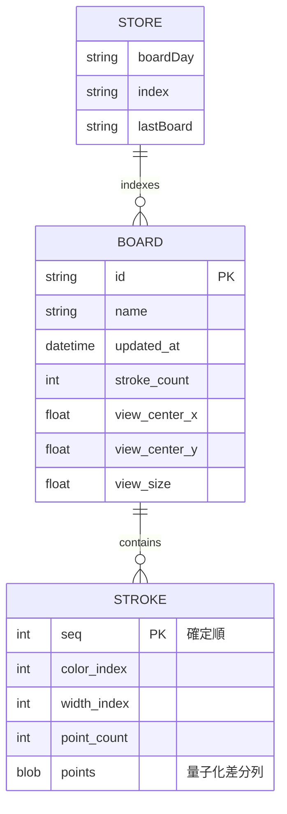

---

## 6. DFD

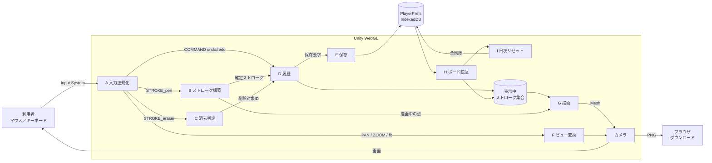

---

## 7. シーケンス図

### 7.1 描画から保存まで

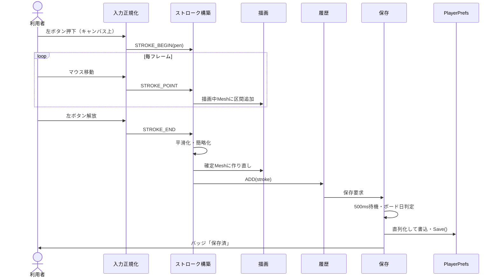

### 7.2 窓外でのボタン解放

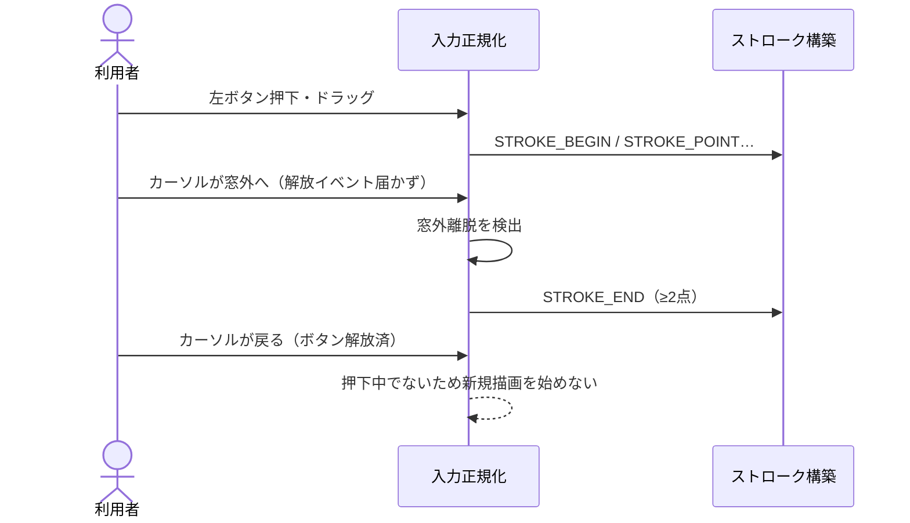

### 7.3 消去とUndo

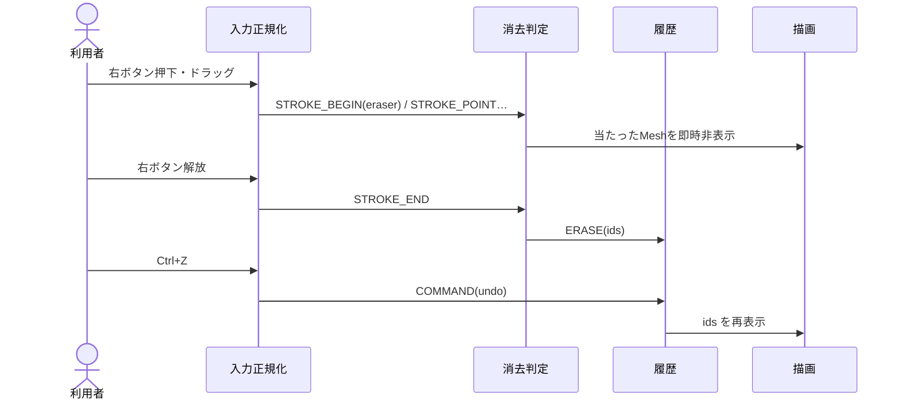

### 7.4 ロード時のリセット判定

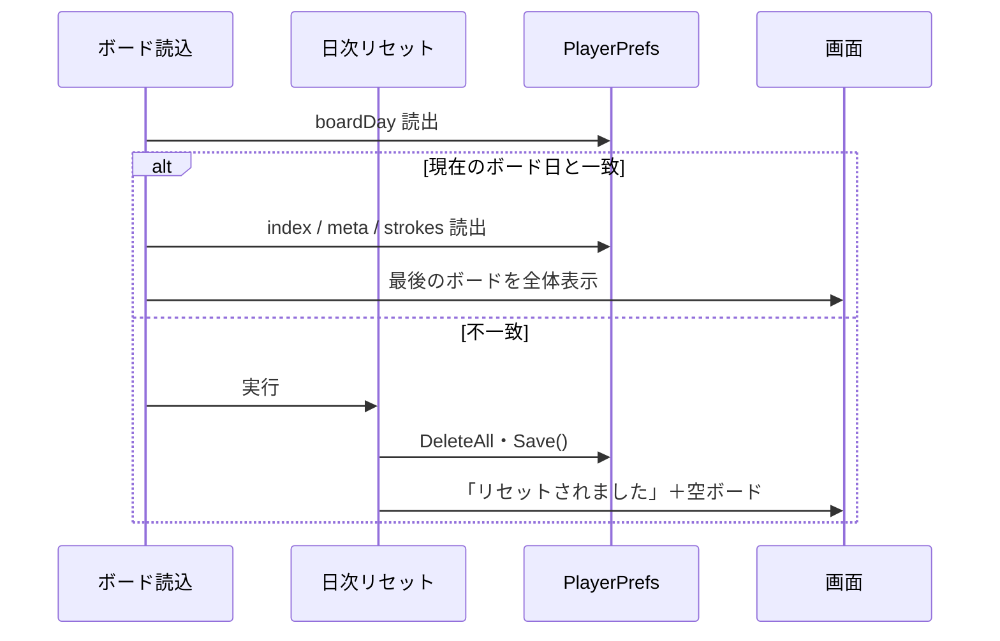

---

## 8. クラス図

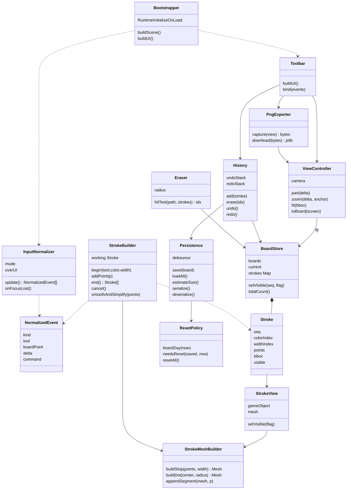

---

## 9. 状態遷移図

### 9.1 入力状態

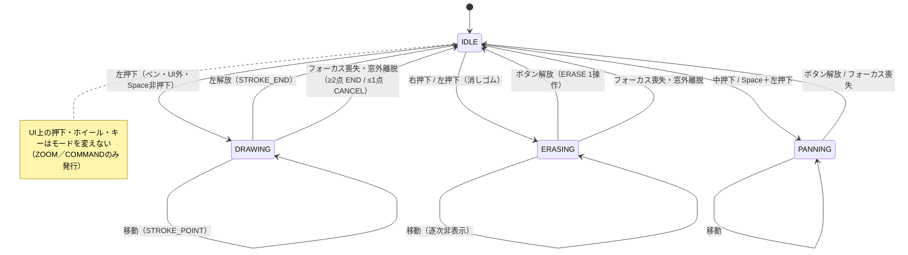

### 9.2 ストロークの状態

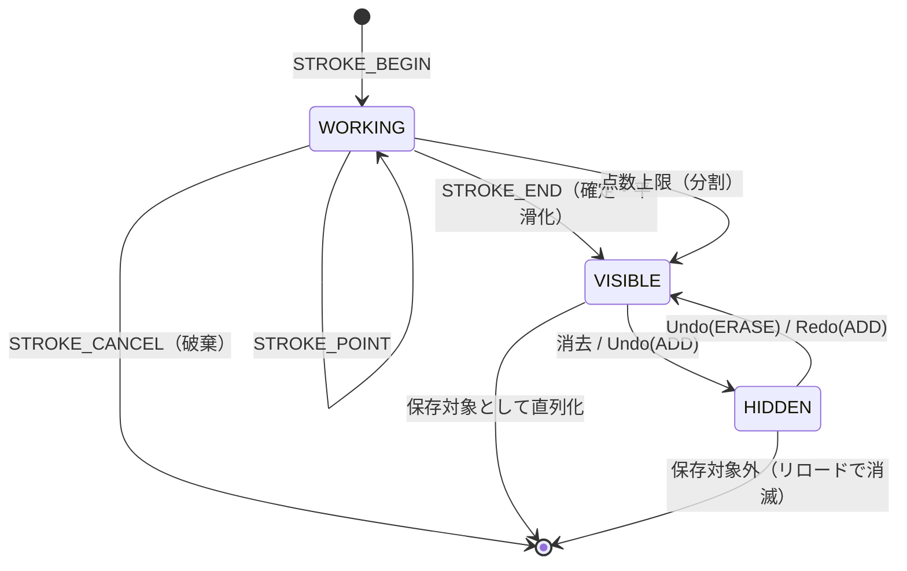

### 9.3 保存状態

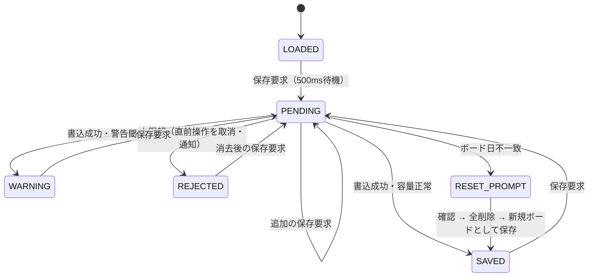

### 9.4 ボード日

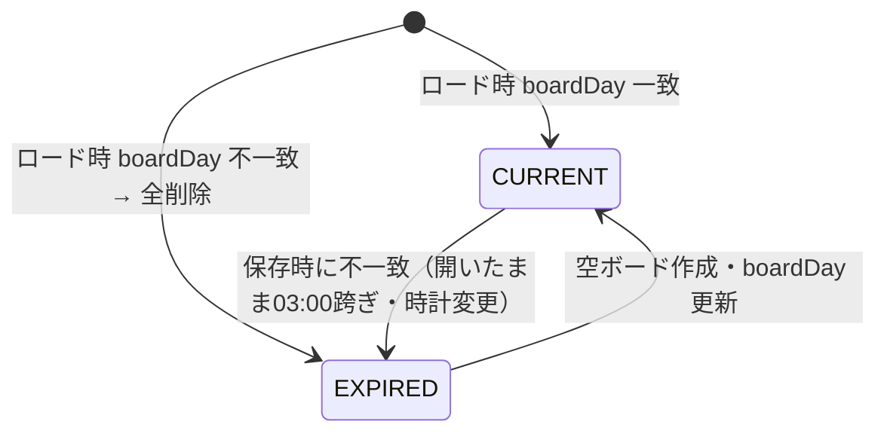

---

## 10. ユースケース図

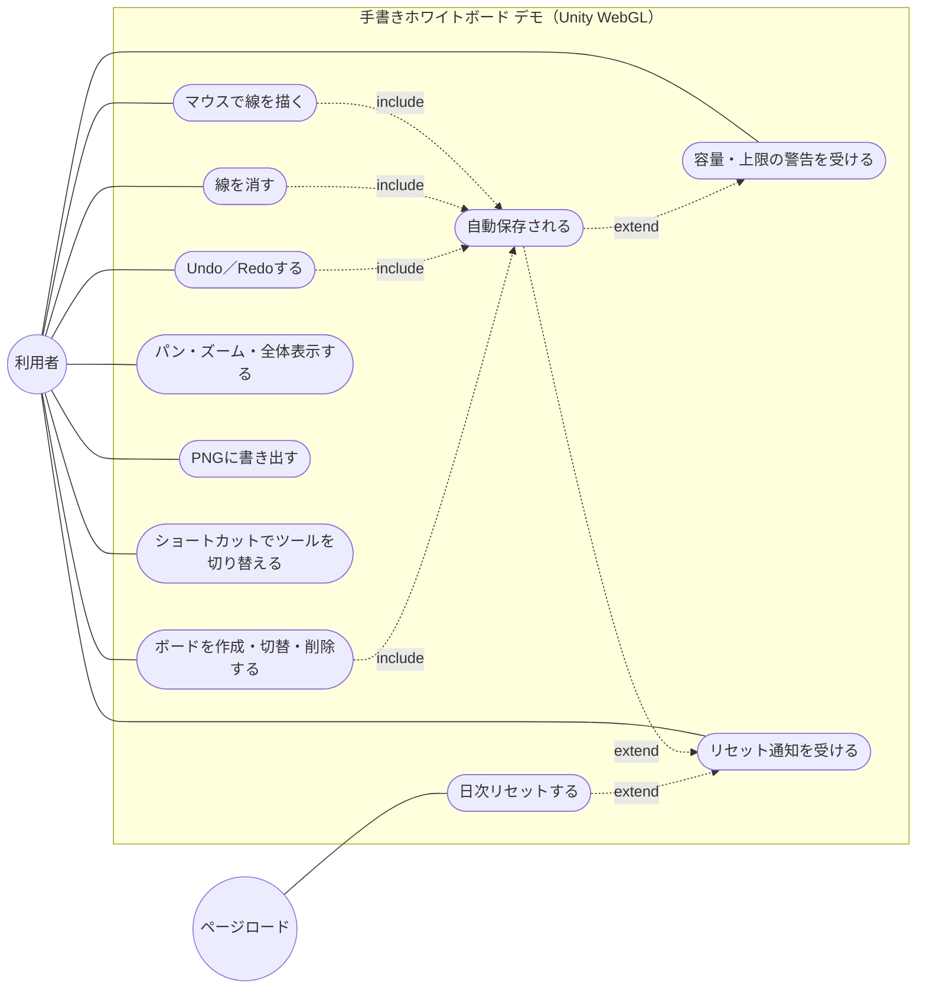

---

## 11. 非機能要件と制約

### 11.1 入力堅牢性の原則

- 入力はInput Systemのマウス・キーボードのみから取得し、旧Inputクラス・ブラウザイベントの直接購読を混在させないこと。
- ブラウザ既定動作（ホイールスクロール・コンテキストメニュー・ショートカット・テキスト選択）はWebGLテンプレートで一括抑止し、Unity側で個別対処しないこと。
- 描画中・消去中・パン中の状態は、ボタン解放だけでなくフォーカス喪失・窓外離脱・「押下中でないことの検出」のいずれでも必ず閉じ、モードが残留して以後の入力が誤解釈される状態を作らないこと。
- UI上で始まったドラッグをキャンバスに渡さないこと。
- モードは常に1つとし、描画とパンを同時に成立させないこと。

### 11.2 描画とデータの原則

- 保存座標はボード座標のみとし、ズーム・画面サイズ・解像度を含めないこと。
- ストローク1本＝Mesh1つとし、ズーム・パンでMeshを再生成しないこと。
- 消去は非表示化とし、Undoで点列を再送・再生成しないこと。非表示ストロークは保存しないこと。
- 1点のストロークはドットとして扱い、幅0の頂点を生成しないこと。
- 1ストロークは点数上限で分割すること。
- 色はグレースケールでも判別できる明度差を持たせ、色のみで意味を区別しないこと。

### 11.3 保存の原則

- 保存前に直列化サイズを見積もり、自前の上限で拒否・警告すること。PlayerPrefsの実装依存の失敗に任せないこと。
- 保存時にもボード日を再判定し、境界を跨いだ端末が旧データを上書きしないこと。跨いだ場合も利用者の確認前に書いている内容を失わせないこと。
- 復号に失敗したボードは読み飛ばし、他のボードを失わせないこと。

### 11.4 レイアウトとビルド

- UIは1920×1080基準の固定レイアウトとし、CanvasScalerの等倍スケール（Match 0.5）と余白のみで画面に追従する。ブレークポイントによる再配置・要素の出し入れを行わない。
- 対象はPCブラウザ（横長・1280×720以上）とする。スマホ・タブレットのブラウザ、タッチ・ペン・筆圧は対象外とし、スマホ版で入力層を差し替えて対応する前提とする。
- シーン・UI・オブジェクトはすべてC#で動的生成し、Editor GUI操作を要しないこと。EventSystem・CanvasScaler・カメラもコードで生成する。
- ビルドは`Unity.exe -batchmode -nographics -executeMethod`でCLI実行し、Unity Playへのアップロードのみ手動とする。
- 外部との通信を一切持たないこと。PNG書き出しのjslibはブラウザのダウンロード呼び出しのみを行う。

### 11.5 データと個人情報

- 個人情報を一切取得しない。ボード名は任意入力とし、個人を特定できる情報を入力しないよう注記する。
- データはブラウザのPlayerPrefs（オリジン単位）に閉じ、他の端末・他の利用者と共有されない。
- 日次リセットはJST 03:00境界のボード日で判定し、リセット時刻を常時表示する。

### 11.6 リポジトリ構成

```
handwriting-whiteboard-unity-demo/
├── Assets/
│   ├── Scripts/
│   │   ├── Boot/          # Bootstrapper（シーン・UI・カメラの動的生成）
│   │   ├── Input/         # InputNormalizer
│   │   ├── Stroke/        # StrokeBuilder・StrokeMeshBuilder・Eraser
│   │   ├── Board/         # BoardStore・History・Persistence・ResetPolicy
│   │   ├── View/          # ViewController・Toolbar・PngExporter
│   │   └── Editor/        # CLIビルド用 BuildScript
│   ├── Plugins/WebGL/     # ダウンロード用 jslib
│   └── WebGLTemplates/    # 既定動作抑止を含むテンプレート
├── Packages/manifest.json # Input System
├── ProjectSettings/
├── docs/
│   └── spec.md            # 本書
└── README.md
```

---

## 12. 用語

| 用語 | 定義 |
|---|---|
| ストローク | 1回の左ドラッグで描かれた点列（ボード座標）と属性（色・太さ）の単位 |
| ボード座標 | ズーム・パン・画面サイズに依存しない無限平面の座標。保存と判定の基準 |
| ボード日 | JST 03:00を境界とする日付。リセット判定に用いる |
| 正規化済みイベント | マウス・キーボード入力を描画／消去／パン／ズーム／コマンドの意図に変換したもの |
| 非表示化 | 消去の実体。Meshを非表示にし点列は保持する。Undoで再表示できる |
| ドット | 1点のストローク。直径＝太さの円 |
| 固定レイアウト | 1920×1080基準の等倍スケールのみで追従し、再配置しないUI |
| 保存容量の上限 | 全ボードの直列化サイズの自前上限。PlayerPrefsの実装上限より低く設定する |
| 全体表示 | 表示中ストロークの外接矩形が収まるビュー |
